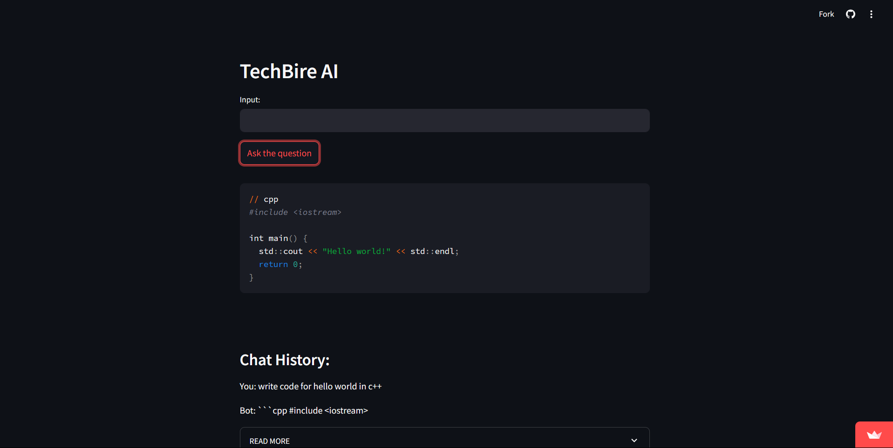

# TechBire AI



[Watch the project demo on YouTube](https://www.youtube.com/watch?v=Toku4YUv2aQ)


Welcome to the **TechBire AI** project! This streamlit application leverages the power of Google Gemini AI to provide intelligent responses to user queries. The app is built using Streamlit for a seamless and interactive web interface.

## Features

- **Interactive Chat Interface**: Engage in a conversation with the AI by inputting your questions and receiving detailed responses.
- **Code Snippet Formatting**: The AI can provide code snippets in various programming languages, which are displayed with proper formatting.
- **Chat History**: View the complete history of your interactions with the AI.

## Installation

### Prerequisites

- Python 3.7 or higher
- Streamlit
- Google Generative AI Python client library
- A `.env` file with your Google API key

### Setup

1. **Clone the repository:**
    ```sh
    git clone https://github.com/yourusername/techbire-ai.git
    cd techbire-ai
    ```

2. **Install the required packages:**
    ```sh
    pip install streamlit google-generativeai python-dotenv
    ```

3. **Create a `.env` file in the project root directory and add your Google API key:**
    ```sh
    GOOGLE_API_KEY=your_api_key_here
    ```

4. **Run the Streamlit app:**
    ```sh
    streamlit run app.py
    ```

## Usage

1. Open the Streamlit app in your browser. It will typically be available at `http://localhost:8501`.

2. Enter your question in the input box and either press Enter or click the "Ask the question" button.

3. The AI's response will be displayed, including any formatted code snippets if applicable.

4. View the chat history to see previous interactions with the AI.

## Code Overview

- **Environment Setup**: Loads environment variables and configures the Google Generative AI.
- **Generative AI Configuration**: Sets up the `GenerativeModel` with the Gemini Pro model for generating responses.
- **Streamlit Initialization**: Configures the Streamlit app and sets up the user interface elements.
- **Input Handling**: Processes user input and retrieves responses from the AI.
- **Response Display**: Formats and displays the AI responses, including handling code snippets.
- **Chat History**: Maintains and displays a history of user and AI interactions.

---

Enjoy using **TechBire AI**! If you have any questions or need further assistance, please feel free to reach out.
